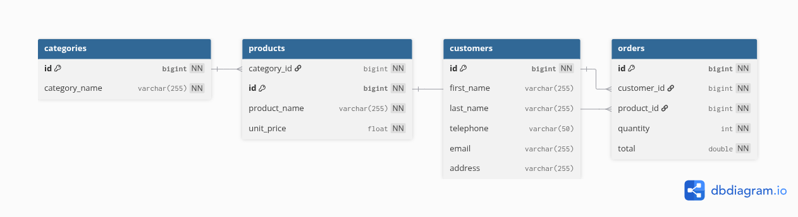

# spring-microservices-tutorial

A complete tutorial for building a **Spring Cloud microservices** architecture with **Spring Boot 4.1.x** (Spring Framework 7, Java 17), decomposing an identity/RBAC domain (users, roles, permissions, tokens) and an e-commerce domain (categories, products, customers, orders) into independently deployable services.

This is a **monorepo**: one Git repository, one folder per microservice, each with its own `pom.xml` and its own deployment lifecycle - not a shared multi-module library like `spring-hexagonal-ddd-tutorial` or `spring-tutorial`.

This document is the **complete specification** of the project: it is meant to be followed step by step to implement each branch.

## Table of contents

- [Service decomposition](#service-decomposition)
- [Why `users` and `customers` stay in separate services](#why-users-and-customers-stay-in-separate-services)
- [Scope: what this tutorial covers, and what it deliberately leaves out](#scope-what-this-tutorial-covers-and-what-it-deliberately-leaves-out)
- [Tech stack](#tech-stack)
- [Architecture overview](#architecture-overview)
- [Load balancing](#load-balancing)
- [Data model](#data-model)
- [common-lib: what belongs in a shared library, and what never does](#common-lib-what-belongs-in-a-shared-library-and-what-never-does)
- [Design patterns used](#design-patterns-used)
- [Branching strategy](#branching-strategy)
- [Repository structure](#repository-structure)
- [Standard response format](#standard-response-format)
- [feature/common-lib](#featurecommon-lib)
- [feature/infrastructure](#featureinfrastructure)
- [feature/auth-service](#featureauth-service)
- [feature/catalog-service](#featurecatalog-service)
- [feature/customer-service](#featurecustomer-service)
- [feature/order-service](#featureorder-service)
- [feature/notification-service](#featurenotification-service)
- [feature/api-gateway](#featureapi-gateway)
- [feature/observability](#featureobservability)
- [feature/resilience](#featureresilience)
- [feature/contract-testing (bonus)](#featurecontract-testing-bonus)
- [Order of work](#order-of-work)
- [Code conventions](#code-conventions)
- [Concepts covered](#concepts-covered)
- [How to follow this tutorial](#how-to-follow-this-tutorial)

## Service decomposition

Two EER diagrams, four business domains, plus one service with no database of its own:

| Service | Owns | Source model |
|---|---|---|
| `auth-service` | `users`, `roles`, `permissions`, `role_user`, `role_permission`, `activation_tokens`, `blacklisted_tokens`, `password_reset_tokens` | `spring-security-tutorial`'s EER |
| `catalog-service` | `categories`, `products` | E-commerce EER |
| `customer-service` | `customers` | E-commerce EER |
| `order-service` | `orders`, `idempotency_keys` | E-commerce EER, extended |
| `notification-service` | Nothing persisted - reacts to events, sends notifications | New, event-driven |

Plus three infrastructure services with no business data of their own:

| Service | Role |
|---|---|
| `discovery-server` | Eureka service registry - every other service registers itself here |
| `config-server` | Spring Cloud Config - centralizes each service's `application.yml` |
| `api-gateway` | Spring Cloud Gateway - single entry point, JWT validation, rate limiting, routing to every business service |

## Why `users` and `customers` stay in separate services

Both EERs have a table holding a name and an email (`users` in the identity model, `customers` in the e-commerce model). In a monolith these could plausibly be merged; in microservices they are kept **deliberately separate**, because they answer different questions:

- `auth-service`'s `users` = *can this request authenticate, and what is it allowed to do* - identity, credentials, roles, permissions
- `customer-service`'s `customers` = *who is this business-wise* - billing address, phone, order history context

`customer-service` never queries `auth-service`'s database directly (no cross-service foreign key). It stores a `userId` column referencing the identity created in `auth-service`, resolved only through that service's API when needed. This is the standard **database-per-service** boundary: a foreign key that crosses a service boundary is a sign the boundary is wrong, so IDs are carried as plain values, not enforced constraints.

## Scope: what this tutorial covers, and what it deliberately leaves out

**Covered**, because each one exposes a genuine microservices concern that a single-service tutorial can't: service discovery, centralized configuration, an API gateway, synchronous inter-service calls (OpenFeign), asynchronous event-driven communication (Kafka), a choreographed Saga with a compensating action, idempotent writes, distributed tracing, circuit breakers, rate limiting, health-check groups, and consumer-driven contract testing.

**Deliberately left out**, and why:
- **Service mesh** (Istio, Linkerd) - an alternative to Spring Cloud Gateway/Eureka/LoadBalancer for cross-cutting network concerns, not a complement; mixing both in one tutorial would teach two competing ways to solve the same problems and confuse which one is "doing" service discovery or retries
- **Kubernetes** - deploying this system on k8s is a legitimate follow-up, but it's a large enough topic (manifests, Ingress, ConfigMaps, readiness/liveness wiring, Helm) to deserve its own dedicated tutorial rather than being bolted onto this one
- **Secrets management** (Vault, cloud KMS) - genuinely important in real production systems, but orthogonal to the microservices patterns this tutorial focuses on; `config-server` here uses a classpath-backed repo with no real secrets in it

## Tech stack

| Component | Choice |
|---|---|
| Framework | Spring Boot 4.1.x (Spring Framework 7) |
| Language | Java 17 (LTS) |
| Microservices toolkit | Spring Cloud 2025.1.2 ("Oakwood", compatible with Spring Boot 4.1.x) |
| Service discovery | Spring Cloud Netflix Eureka |
| Centralized configuration | Spring Cloud Config Server (native/classpath-backed config repo) |
| API Gateway | Spring Cloud Gateway |
| Synchronous inter-service calls | OpenFeign |
| Asynchronous inter-service calls | Apache Kafka (`spring-kafka`), KRaft mode |
| Resilience | Resilience4j (circuit breaker, fallback methods on Feign clients) |
| Rate limiting | Redis-backed `RequestRateLimiter` (Spring Cloud Gateway) |
| Distributed tracing | Micrometer Tracing (Brave bridge) + Zipkin |
| Contract testing *(bonus)* | Spring Cloud Contract (producer contracts + consumer stub runner) |
| Build | Maven (reactor aggregator at the repo root, for convenience - not a source of shared runtime code by itself; see `common-lib`) |
| Database | PostgreSQL 16, **one database per service**, single container in `docker-compose.yml`, four separate databases |
| ORM | Spring Data JPA / Hibernate |
| Migrations | Flyway, one migration history per service |
| Security | Spring Security 7 + JWT, validated at the gateway and again at each service |
| API documentation | springdoc-openapi per service |
| Monitoring | Spring Boot Actuator on every service, with `liveness`/`readiness` health groups |
| Tests | JUnit 5, Mockito, Testcontainers, `WireMock` for stubbing Feign dependencies in isolation |
| CI/CD | GitHub Actions, one job per service, only building/testing what changed |
| Containerization | Docker, docker-compose (all services + PostgreSQL + Kafka + Redis + Zipkin) |

## Architecture overview

```
                              ┌──────────────────┐
                              │ discovery-server  │  (Eureka)
                              └─────────▲─────────┘
                                        │ registers
                  ┌─────────────────────┼─────────────────────┬───────────────────┐
                  │                     │                     │                   │
         ┌────────┴───────┐   ┌─────────┴────────┐   ┌────────┴────────┐  ┌───────┴────────┐
         │  auth-service   │   │ catalog-service  │   │ customer-service │  │notification-svc│
         └────────▲────────┘   └─────────▲────────┘   └────────▲────────┘  └───────▲────────┘
                  │                     │                     │                   │
                  │            ┌────────┴────────┐            │            Kafka topic
                  │            │  order-service   │────────────┘        "order-events"
                  │            └────────▲─────────┘                          ▲
                  │                     │  (OpenFeign, sync)                  │
                  │                     └──────────────────────publishes─────┘
                  │                       (OrderCreatedEvent, async, Kafka)
                  │
                  └─────────────────────┬─────────────────────┐
                                        │                     │
                              ┌─────────┴────────┐   ┌─────────┴────────┐
                              │   api-gateway     │   │  config-server   │
                              │ (rate limiting,   │   └──────────────────┘
                              │  JWT validation)  │
                              └─────────▲─────────┘
                                        │
                                    client apps

Cross-cutting, present on every service: Micrometer Tracing → Zipkin, Actuator health groups,
common-lib (ApiResponse<T>, base exceptions, tracing-aware logging).
```

- Every business service registers with `discovery-server` and pulls its configuration from `config-server` at startup
- `order-service` calls `catalog-service`/`customer-service` **synchronously** (OpenFeign) to validate a product/customer exist before creating an order
- `order-service` also publishes an `OrderCreatedEvent` **asynchronously** (Kafka) after committing the order; `notification-service` consumes it - this is the tutorial's second, deliberately different communication style, and the trigger for the choreographed Saga (see [Design patterns used](#design-patterns-used))
- `api-gateway` is the only service exposed to the outside world; every other service is reachable only inside the Docker network

## Load balancing

Every inter-service call in this tutorial is **client-side load balanced**, even though it's easy to miss because nothing explicitly says "load balancer" in the code:

- OpenFeign clients (`@FeignClient(name = "catalog-service")`) resolve `catalog-service` through Eureka and pick an instance via **Spring Cloud LoadBalancer**, Spring Cloud's default client-side load balancer - if `catalog-service` is scaled to 3 instances, Feign calls are distributed across all 3 without any code change
- `api-gateway`'s routes use the `lb://catalog-service` URI scheme, which tells Spring Cloud Gateway to resolve the target through the same load-balancer/Eureka combination rather than a fixed host
- There is no separate load-balancer *service* to deploy - it's a library-level concern embedded in the caller (Feign, Gateway), not infrastructure like `discovery-server` is

## Data model

Four separate databases, one per business service with its own schema; `notification-service` has none. Only relationships *within* a database are real foreign keys, every relationship that would cross a service boundary is deliberately a plain column instead (see [Why `users` and `customers` stay in separate services](#why-users-and-customers-stay-in-separate-services)).




```
auth-service DB (auth_db):       users, roles, permissions, role_user, role_permission,
                                  activation_tokens, blacklisted_tokens, password_reset_tokens

customer-service DB (customer_db): customers (id, user_id, first_name, last_name, telephone, email, address)
                                    └─ user_id: plain value referencing auth-service's users.id, no FK

catalog-service DB (catalog_db):   categories (id, category_name)
                                    products (id, category_id, product_name, unit_price)

order-service DB (order_db):       orders (id, customer_id, product_id, quantity, total, status)
                                    └─ customer_id: plain value referencing customer-service's customers.id, no FK
                                    └─ product_id: plain value referencing catalog-service's products.id, no FK
                                    └─ status: PENDING, CONFIRMED, CONFIRMATION_FAILED
                                    idempotency_keys (id, idempotency_key, order_id, created_at)
                                    └─ order_id: FK → orders.id (same database, real FK)
                                    └─ idempotency_key: UNIQUE, supplied by the client as an
                                       "Idempotency-Key" header on POST /api/v1/orders

notification-service:              no database, stateless Kafka consumer
```

### `auth_db` relationships

Same domain and same shape as `spring-security-tutorial`'s EER, entirely self-contained within `auth_db`, so every relationship below is a real foreign key:

```
                        ┌──────────────┐
                        │    users     │
                        └──────┬───────┘
              ┌────────────────┼────────────────────┬──────────────────┐
              │                │                     │                  │
     activation_tokens  password_reset_tokens  blacklisted_tokens   role_user
                                                                          │
                                                                       roles
                                                                          │
                                                                    role_permission
                                                                          │
                                                                    permissions
```

- `users` N-N `roles` via the join table `role_user`
- `roles` N-N `permissions` via the join table `role_permission`
- `users` 1-N `activation_tokens`, `password_reset_tokens`, `blacklisted_tokens`

### `catalog_db` relationship

```
categories (id, category_name)
    │ 1
    │
    │ N
products (id, category_id, product_name, unit_price)
```

- `categories` 1-N `products`, a real foreign key (both tables live in `catalog_db`)

### Column details

**users** (`auth_db`)
| Column | Type | Constraints |
|---|---|---|
| id | BIGINT | PK, auto-increment |
| first_name | VARCHAR(50) | NOT NULL |
| last_name | VARCHAR(100) | NOT NULL |
| email | VARCHAR(100) | NOT NULL, UNIQUE |
| password | VARCHAR(255) | NOT NULL, hashed (BCrypt) |
| enabled | BOOLEAN | NOT NULL, defaults to `false` (enabled once the account is validated) |
| account_locked | BOOLEAN | NOT NULL, defaults to `false` |

**roles** (`auth_db`)
| Column | Type | Constraints |
|---|---|---|
| id | BIGINT | PK, auto-increment |
| role_name | VARCHAR(50) | NOT NULL, UNIQUE (e.g. `ADMIN`, `USER`) |

**permissions** (`auth_db`)
| Column | Type | Constraints |
|---|---|---|
| id | BIGINT | PK, auto-increment |
| resource | VARCHAR(50) | NOT NULL (e.g. `PRODUCT`, `USER`) |
| action | VARCHAR(50) | NOT NULL (e.g. `READ`, `WRITE`, `DELETE`) |

**role_user** (`auth_db`, join table)
| Column | Type | Constraints |
|---|---|---|
| user_id | BIGINT | Composite PK, FK → users.id |
| role_id | BIGINT | Composite PK, FK → roles.id |

**role_permission** (`auth_db`, join table)
| Column | Type | Constraints |
|---|---|---|
| role_id | BIGINT | Composite PK, FK → roles.id |
| permission_id | BIGINT | Composite PK, FK → permissions.id |

**activation_tokens** (`auth_db`)
| Column | Type | Constraints |
|---|---|---|
| id | BIGINT | PK, auto-increment |
| user_id | BIGINT | FK → users.id |
| token | VARCHAR(255) | NOT NULL |
| created_at | DATETIME | NOT NULL |
| expires_at | DATETIME | |
| validated_at | DATETIME | set when the account is activated |

**blacklisted_tokens** (`auth_db`)
| Column | Type | Constraints |
|---|---|---|
| id | BIGINT | PK, auto-increment |
| user_id | BIGINT | FK → users.id |
| token | VARCHAR(768) | NOT NULL, full JWT |
| jti | VARCHAR(255) | UNIQUE, JWT identifier |
| blacklisted_at | DATETIME | |
| created_at | DATETIME | NOT NULL |
| expires_at | DATETIME | JWT expiration date (for purging) |
| validated_at | DATETIME | |

**password_reset_tokens** (`auth_db`)
| Column | Type | Constraints |
|---|---|---|
| id | BIGINT | PK, auto-increment |
| user_id | BIGINT | FK → users.id |
| token | VARCHAR(255) | NOT NULL |
| type | VARCHAR(255) | NOT NULL (e.g. `PASSWORD_RESET`) |
| expiry_date | DATETIME | NOT NULL |

**categories** (`catalog_db`)
| Column | Type | Constraints |
|---|---|---|
| id | BIGINT | PK, auto-increment |
| category_name | VARCHAR(255) | NOT NULL |

**products** (`catalog_db`)
| Column | Type | Constraints |
|---|---|---|
| id | BIGINT | PK, auto-increment |
| category_id | BIGINT | FK → categories.id, NOT NULL (same database, real FK) |
| product_name | VARCHAR(255) | NOT NULL |
| unit_price | FLOAT | NOT NULL, > 0 |

**customers** (`customer_db`)
| Column | Type | Constraints |
|---|---|---|
| id | BIGINT | PK, auto-increment |
| user_id | BIGINT | Plain value referencing auth-service's users.id, no FK, unresolved locally, resolved through auth-service's API when needed |
| first_name | VARCHAR(255) | NOT NULL |
| last_name | VARCHAR(255) | NOT NULL |
| telephone | VARCHAR(50) | NOT NULL |
| email | VARCHAR(255) | NOT NULL, UNIQUE, valid email format |
| address | VARCHAR(255) | NOT NULL |

**orders** (`order_db`)
| Column | Type | Constraints |
|---|---|---|
| id | BIGINT | PK, auto-increment |
| customer_id | BIGINT | Plain value referencing customer-service's customers.id, no FK, validated via `CustomerClient` (Feign) before insert |
| product_id | BIGINT | Plain value referencing catalog-service's products.id, no FK, validated via `ProductClient` (Feign) before insert |
| quantity | INT | NOT NULL, > 0 |
| total | DOUBLE | NOT NULL, computed = quantity × product unit_price resolved via `ProductClient` at creation time |
| status | VARCHAR(50) | NOT NULL, defaults to `PENDING` (`PENDING`, `CONFIRMED`, `CONFIRMATION_FAILED`) |

**idempotency_keys** (`order_db`)
| Column | Type | Constraints |
|---|---|---|
| id | BIGINT | PK, auto-increment |
| idempotency_key | VARCHAR(255) | NOT NULL, UNIQUE, supplied by the client via the `Idempotency-Key` header on `POST /api/v1/orders` |
| order_id | BIGINT | FK → orders.id, NOT NULL (same database, real FK) |
| created_at | DATETIME | NOT NULL |

## common-lib: what belongs in a shared library, and what never does

Every business service duplicating `ApiResponse<T>`, exception handling, and logging setup independently was the original design of this tutorial - and it was a mistake once logging, exceptions, and cross-cutting concerns were actually thought through. In a **monorepo**, the usual risk of a shared library (services silently drifting onto different versions) is largely neutralized: `common-lib` and all seven services are built and tested together, on the same commit, in the same CI - a breaking change in `common-lib` fails the whole build immediately, not six months later in one forgotten service.

So `common-lib` exists, as a plain JAR dependency (never a deployable service), with a strict rule about its contents:

**Allowed in `common-lib`** - cross-cutting infrastructure that should almost never change and carries no business meaning on its own:
- `ApiResponse<T>`, `PageResponse<T>`
- `ResourceNotFoundException`, `BusinessRuleException`, and a `BaseExceptionHandler` each service's own `@RestControllerAdvice` extends
- A minimal logging helper - see the tracing note below

**Never allowed in `common-lib`**, even if it would be convenient:
- Any JPA entity, repository, or domain-specific DTO (`ProductResponse` stays in `catalog-service`, always)
- Any business rule
- Any dependency on a specific service's data shape

**Note on logging, now that tracing is in scope**: the original plan for `common-lib` included a hand-rolled `CorrelationIdFilter` and a Feign interceptor to propagate a custom header across services. Once `feature/observability` adds **Micrometer Tracing**, that becomes redundant - Micrometer Tracing already injects a `traceId`/`spanId` pair into the logging MDC automatically, and propagates it across both Feign calls and Kafka messages out of the box. `common-lib` only needs a thin `LoggingAspect` (Spring AOP, `@Around` on the service layer) that logs method entry/exit using whatever trace context Micrometer has already placed in the MDC - it does not reimplement propagation itself.

## Design patterns used

Every architectural choice made above is a named pattern from the microservices literature (mostly Chris Richardson's [microservices.io](https://microservices.io) catalog). Naming them explicitly here is deliberate: knowing the pattern name is what lets the concept transfer to a different stack later.

| Pattern | Category | Problem it solves | Where in this project |
|---|---|---|---|
| Database per Service | Data | Keep each service's schema private so services can evolve and scale independently | Every business service, one schema each (see [Data model](#data-model)) |
| Shared Kernel, deliberately narrowed | Data / code sharing | Cross-cutting boilerplate (`ApiResponse<T>`, base exceptions) duplicated identically in every service | `common-lib`, with a strict allow-list (see [common-lib](#common-lib-what-belongs-in-a-shared-library-and-what-never-does)); normally an anti-pattern across independently-deployed services, viable here specifically because it's a monorepo built as one unit |
| Service Registry, client-side discovery | Discovery | Callers need up-to-date instance locations without hardcoding hosts/ports | `discovery-server` (Eureka) + Spring Cloud LoadBalancer, used by both Feign and the gateway (see [Load balancing](#load-balancing)) |
| Externalized Configuration | Configuration | Change a service's config without rebuilding or redeploying it | `config-server` (Spring Cloud Config, classpath-backed) |
| API Gateway | Communication | One entry point for routing, authentication, and rate limiting instead of every client talking to every service directly | `api-gateway` |
| API Composition | Query | Assemble one response from data that lives in several services | `GET /api/v1/orders/{id}`, enriched with product/customer data resolved via Feign |
| Circuit Breaker | Resilience | Stop calling a downstream that's already failing, fail fast instead of piling up timeouts | `feature/resilience`, Resilience4j around `ProductClient`/`CustomerClient` |
| Rate Limiter | Resilience | Protect a service (here, `auth-service`) from being overwhelmed by a single client | `RateLimiterConfig`, Redis-backed, on `/api/v1/auth/login` |
| Saga, choreography-based | Data consistency | Coordinate a business transaction across services without a distributed transaction/2PC | `order-service` ↔ `notification-service`, full walkthrough below |
| Idempotent Consumer | Messaging / resilience | Safely handle a client retry or a duplicate request without creating a duplicate resource | `Idempotency-Key` header + `idempotency_keys` table on `POST /api/v1/orders` |
| Event-Driven, Publish-Subscribe | Communication | Decouple the producer from its consumers, let new consumers subscribe later without the producer changing | Kafka topics: `order-events`, `notification-events`, `auth-events` |
| Health Check API | Observability | Let an orchestrator or load balancer know whether an instance is alive and ready for traffic, separately | Actuator `liveness`/`readiness` health groups on every service |
| Distributed Tracing | Observability | Follow one logical request as it crosses multiple service boundaries, both sync and async | Micrometer Tracing + Zipkin (`feature/observability`) |
| Consumer-Driven Contract Testing | Testing | Catch a producer's breaking API change at build time, before it ever reaches a deployed consumer | `feature/contract-testing` (bonus), Spring Cloud Contract |

### The Saga in detail: order confirmation

The only two-way choreography in this tutorial. No orchestrator, no distributed transaction: `order-service` and `notification-service` each manage only their own local transaction, coordinated entirely by reacting to each other's events.

```
1. client          -- POST /api/v1/orders (Idempotency-Key: <key>) -->  order-service
2. order-service    checks idempotency_keys for <key>; not found, continues
3. order-service    validates productId/customerId synchronously (OpenFeign: ProductClient, CustomerClient)
4. order-service    persists Order(status=PENDING) + IdempotencyKey, same local transaction, commits
5. order-service    -- publishes OrderCreatedEvent{orderId, ...} on "order-events" -->  (only after step 4 commits)
6. notification-service  OrderCreatedEventConsumer receives it, calls EmailNotificationService

   nominal path                                    simulated-failure path
   ─────────────                                    ──────────────────────
7a. "e-mail" logged successfully                  7b. "e-mail" fails (configured trigger)
8a. OrderConfirmedEventProducer publishes         8b. NotificationFailedEventProducer publishes
    OrderConfirmedEvent{orderId}                       NotificationFailedEvent{orderId}
    on "notification-events"                           on "notification-events"
9a. order-service's OrderConfirmedEventListener   9b. order-service's NotificationFailedEventListener
    sets Order.status: PENDING → CONFIRMED             sets Order.status: PENDING → CONFIRMATION_FAILED
```

An order is never stuck in `PENDING` forever by design: exactly one of the two outcome events always follows `OrderCreatedEvent`, so `order-service` always eventually hears back.

**Event topics at a glance**

| Topic | Producer | Consumer | Events carried | Part of the Saga? |
|---|---|---|---|---|
| `order-events` | `order-service` | `notification-service` | `OrderCreatedEvent` | Triggers it |
| `notification-events` | `notification-service` | `order-service` | `OrderConfirmedEvent`, `NotificationFailedEvent` | Both outcomes |
| `auth-events` | `auth-service` | `notification-service` | `UserRegisteredEvent`, `PasswordResetRequestedEvent` | No, fire-and-forget (see [feature/notification-service](#featurenotification-service)) |

**A documented simplification**: publishing right after the local transaction commits (see the *publish-after-commit* rule) narrows, but does not eliminate, the window where a crash between commit and publish would silently drop an event, since the commit and the publish are still two separate operations, not one atomic unit. The stricter fix is the **Transactional Outbox** pattern (write the event to an outbox table in the same transaction, relay it separately via CDC or a polling publisher). Left out here deliberately, for the same reason given in [Scope](#scope-what-this-tutorial-covers-and-what-it-deliberately-leaves-out): a correct outbox implementation (Debezium/CDC or a polling relay with deduplication) is a large enough topic to deserve its own tutorial rather than being bolted onto this one.

## Branching strategy

| Branch | Role |
|---|---|
| `master` | Stable, production-ready code. No direct commits, only merges from `develop`. |
| `develop` | Integration branch. |
| `feature/common-lib` | Shared JAR: `ApiResponse<T>`, base exceptions, tracing-aware `LoggingAspect`. |
| `feature/infrastructure` | `discovery-server` and `config-server`. |
| `feature/auth-service` | Identity/RBAC service (same domain as `spring-security-tutorial`). |
| `feature/catalog-service` | Categories/products service. |
| `feature/customer-service` | Customer profile service. |
| `feature/order-service` | Orders service: OpenFeign calls, idempotent creation, publishes `OrderCreatedEvent`. |
| `feature/notification-service` | Kafka consumer, choreographed Saga compensating action. |
| `feature/api-gateway` | Single entry point, JWT validation, rate limiting, routing. |
| `feature/observability` | Micrometer Tracing + Zipkin across every service. |
| `feature/resilience` | Resilience4j circuit breakers and fallbacks on `order-service`'s Feign clients. |
| `feature/contract-testing` | *Bonus*: Spring Cloud Contract between `order-service` and its two Feign dependencies. |

## Repository structure

```
spring-microservices-tutorial/
├── pom.xml                                  (reactor aggregator, includes common-lib as a real dependency of every service)
├── docker-compose.yml                       (postgres + kafka + redis + zipkin + all 7 services)
├── docker/
│   └── postgres-init/
│       └── 01-create-databases.sql          (creates auth_db, catalog_db, customer_db, order_db)
├── .github/
│   ├── PULL_REQUEST_TEMPLATE.md              (branch, task checklist copied from the README, commit summary, test checklist, code review checklist)
│   └── workflows/
│       ├── ci-common-lib.yml
│       ├── ci-auth-service.yml
│       ├── ci-catalog-service.yml
│       ├── ci-customer-service.yml
│       ├── ci-order-service.yml
│       ├── ci-notification-service.yml
│       ├── ci-api-gateway.yml
│       ├── ci-config-server.yml
│       └── ci-discovery-server.yml
├── common-lib/
│   └── src/main/java/com/edgareldy/springmicroservicestutorial/commonlib/
│       ├── dto/
│       │   ├── ApiResponse.java
│       │   └── PageResponse.java
│       ├── exception/
│       │   ├── ResourceNotFoundException.java
│       │   ├── BusinessRuleException.java
│       │   └── BaseExceptionHandler.java
│       └── logging/
│           └── LoggingAspect.java            (Spring AOP, @Around on the service layer, logs using the trace context Micrometer already put in the MDC)
└── services/
    ├── discovery-server/
    │   └── src/main/java/com/edgareldy/springmicroservicestutorial/discoveryserver/
    │       └── DiscoveryServerApplication.java     (@EnableEurekaServer)
    ├── config-server/
    │   ├── src/main/java/com/edgareldy/springmicroservicestutorial/configserver/
    │   │   └── ConfigServerApplication.java         (@EnableConfigServer)
    │   └── src/main/resources/config-repo/
    │       ├── auth-service.yml
    │       ├── catalog-service.yml
    │       ├── customer-service.yml
    │       ├── order-service.yml
    │       ├── notification-service.yml
    │       └── api-gateway.yml
    ├── auth-service/
    │   └── src/main/java/com/edgareldy/springmicroservicestutorial/authservice/
    │       ├── AuthServiceApplication.java
    │       ├── entity/ ... (users, roles, permissions, tokens - same shape as spring-security-tutorial)
    │       ├── repository/
    │       ├── event/
    │       │   ├── UserRegisteredEvent.java
    │       │   ├── PasswordResetRequestedEvent.java
    │       │   └── AuthEventProducer.java
    │       ├── service/ (interfaces) + service/impl/
    │       ├── controller/
    │       └── security/ (JwtService, JwtAuthFilter)
    ├── catalog-service/
    │   └── src/main/java/com/edgareldy/springmicroservicestutorial/catalogservice/
    │       ├── CatalogServiceApplication.java
    │       ├── entity/ (Category, Product)
    │       ├── repository/
    │       ├── dto/
    │       ├── service/ + service/impl/
    │       ├── controller/
    │       └── contract/                              (bonus: Spring Cloud Contract producer contracts)
    ├── customer-service/
    │   └── src/main/java/com/edgareldy/springmicroservicestutorial/customerservice/
    │       ├── CustomerServiceApplication.java
    │       ├── entity/ (Customer, with a plain userId column)
    │       ├── repository/
    │       ├── dto/
    │       ├── service/ + service/impl/
    │       ├── controller/
    │       └── contract/                              (bonus: Spring Cloud Contract producer contracts)
    ├── order-service/
    │   └── src/main/java/com/edgareldy/springmicroservicestutorial/orderservice/
    │       ├── OrderServiceApplication.java          (@EnableFeignClients)
    │       ├── entity/ (Order, OrderStatus, IdempotencyKey)
    │       ├── repository/
    │       ├── client/
    │       │   ├── ProductClient.java                 (Feign interface → catalog-service)
    │       │   ├── CustomerClient.java                 (Feign interface → customer-service)
    │       │   └── fallback/                            (Resilience4j fallbacks)
    │       ├── event/
    │       │   ├── OrderCreatedEvent.java
    │       │   ├── OrderEventProducer.java
    │       │   ├── OrderConfirmedEventListener.java      (consumes the Saga's success event)
    │       │   └── NotificationFailedEventListener.java (consumes the Saga's compensating event)
    │       ├── dto/
    │       ├── service/ + service/impl/
    │       └── controller/
    ├── notification-service/
    │   └── src/main/java/com/edgareldy/springmicroservicestutorial/notificationservice/
    │       ├── NotificationServiceApplication.java
    │       ├── event/
    │       │   ├── OrderCreatedEventConsumer.java
    │       │   ├── UserRegisteredEventConsumer.java        (sends the activation email)
    │       │   ├── PasswordResetRequestedEventConsumer.java (sends the password-reset email)
    │       │   ├── OrderConfirmedEvent.java               (Saga success event, published back to order-service)
    │       │   ├── OrderConfirmedEventProducer.java
    │       │   ├── NotificationFailedEvent.java          (Saga compensating event, published back to order-service)
    │       │   └── NotificationFailedEventProducer.java
    │       └── service/ + service/impl/ (EmailNotificationService - logs instead of sending real email in this tutorial)
    └── api-gateway/
        └── src/main/java/com/edgareldy/springmicroservicestutorial/apigateway/
            ├── ApiGatewayApplication.java
            ├── config/
            │   ├── RouteConfig.java                    (route definitions, lb:// scheme)
            │   ├── SecurityConfig.java                 (validates JWTs issued by auth-service)
            │   └── RateLimiterConfig.java               (Redis-backed RequestRateLimiter on /api/v1/auth/login)
            └── filter/
                └── JwtValidationGatewayFilter.java
```

## Standard response format

Every business service returns the same generic `ApiResponse<T>`, now defined **once** in `common-lib` and depended on by every service (see [common-lib](#common-lib-what-belongs-in-a-shared-library-and-what-never-does)).

```java
public record ApiResponse<T>(
        boolean success,
        String message,
        T data,
        Instant timestamp
) {
    public static <T> ApiResponse<T> success(T data, String message) {
        return new ApiResponse<>(true, message, data, Instant.now());
    }

    public static <T> ApiResponse<T> error(String message) {
        return new ApiResponse<>(false, message, null, Instant.now());
    }
}
```

`api-gateway` passes each service's `ApiResponse<T>` straight through unmodified - it never rewraps or reshapes response bodies, only routes, authenticates, and rate-limits.

## feature/common-lib

First branch, since every service below depends on it.

### Tasks

- [x] `ApiResponse<T>`, `PageResponse<T>`
- [x] `ResourceNotFoundException`, `BusinessRuleException`, `BaseExceptionHandler` (each service's own `@RestControllerAdvice` extends it, adding service-specific cases)
- [x] `LoggingAspect` (`@Around` on `com.edgareldy.springmicroservicestutorial.*.service..*`), logging method entry/exit and relying on Micrometer Tracing's MDC context (added properly once `feature/observability` is merged - until then, this aspect logs without a trace id, which is fine, since `common-lib` doesn't take on tracing as its own responsibility)
- [x] Published as a regular Maven dependency (`<dependency>`) in every service's `pom.xml`, never copy-pasted
- [x] Unit tests for `BaseExceptionHandler`'s mapping of each exception type
- [x] `.github/workflows/ci-common-lib.yml`, and every other service's CI job depends on this one succeeding first (since they all compile against it)
- [x] `.github/PULL_REQUEST_TEMPLATE.md`: repo-wide, used by every `feature/*` branch's PR from here on - sections for branch name, task checklist (copied from the relevant README section, checked off), commit summary, test checklist, code review checklist (contract/implementation pattern, `ApiResponse<T>` on every endpoint, no business logic leaking into `common-lib`)

## feature/infrastructure

`discovery-server` and `config-server`. No business logic. Merged after `common-lib` (they don't need it - they're infrastructure, not business services - but they must exist before any business service can register or fetch config).

### Tasks

- [x] `discovery-server`: `spring-cloud-starter-netflix-eureka-server`, `@EnableEurekaServer`, `application.yml` with `eureka.client.register-with-eureka=false`/`fetch-registry=false`
- [x] `config-server`: `spring-cloud-config-server`, `@EnableConfigServer`, native profile pointing at `src/main/resources/config-repo/`
- [x] One `<service-name>.yml` per business service in `config-repo/`, each declaring that service's datasource, server port, Eureka client settings, and (from `feature/observability` onward) tracing/Zipkin settings
- [x] Actuator health groups defined per service config: `management.endpoint.health.group.readiness.include` / `.liveness.include`, so each service exposes `/actuator/health/readiness` and `/actuator/health/liveness` separately from the general `/actuator/health`
- [x] `docker/postgres-init/01-create-databases.sql`: creates `auth_db`, `catalog_db`, `customer_db`, `order_db`
- [x] `docker-compose.yml`: `postgres`, `discovery-server`, `config-server` (the rest is added incrementally)
- [x] `.github/workflows/ci-discovery-server.yml`, `ci-config-server.yml`

## feature/auth-service

Same domain as `spring-security-tutorial`, packaged as one microservice among several - with one deliberate difference: it never sends an e-mail itself.

### Endpoints (via the gateway: `/api/v1/auth/**`)

| Method | URL | Description |
|---|---|---|
| POST | `/api/v1/auth/register` | Register (creates a disabled user + activation token, publishes `UserRegisteredEvent`) |
| GET | `/api/v1/auth/activate-account` | Activates a user account |
| POST | `/api/v1/auth/login` | Returns a JWT - rate-limited at the gateway |
| POST | `/api/v1/auth/logout` | Blacklists the current JWT |
| GET | `/api/v1/auth/me` | Current user profile |
| POST | `/api/v1/auth/forgot-password` | Generates a password-reset token, publishes `PasswordResetRequestedEvent` |
| POST | `/api/v1/auth/reset-password` | Consumes the reset token, updates the password |

### Tasks

- [x] Reuse the entity/repository/service/controller shape of `spring-security-tutorial`
- [x] **No `EmailService` in this service.** Where `spring-security-tutorial` called an `EmailService` directly to send the activation/reset e-mail, this service instead publishes an event and lets `notification-service` handle delivery - the same "one service owns everything that leaves the system" rule already applied to `order-service`
- [x] `AuthEventProducer`: publishes `UserRegisteredEvent` (userId, email, activation token) right after registration commits, and `PasswordResetRequestedEvent` (userId, email, reset token) right after a reset is requested - both published **after** the local transaction commits, same rule as `OrderCreatedEvent`
- [x] Depends on `common-lib` for `ApiResponse<T>` and base exceptions
- [x] Registers with `discovery-server`, pulls config from `config-server`
- [x] `JwtService` signs tokens with a shared secret/key, documented clearly since every other business service needs to validate the same tokens independently
- [x] Added to `docker-compose.yml`
- [x] Unit, repository, and controller tests, plus a test verifying both events are only published after their respective transactions commit

## feature/catalog-service

### Endpoints (`/api/v1/catalog/**`)

| Method | URL | Description |
|---|---|---|
| GET | `/api/v1/catalog/categories` | Paginated list |
| POST | `/api/v1/catalog/categories` | Create (ADMIN) |
| GET | `/api/v1/catalog/products` | Paginated list, filterable by `categoryId` |
| GET | `/api/v1/catalog/products/{id}` | Detail - called by `order-service` via Feign |
| POST | `/api/v1/catalog/products` | Create (ADMIN) |

### Tasks

- [ ] `Category`, `Product` entities, repositories, DTOs, contract/implementation services, controllers
- [ ] Depends on `common-lib`
- [ ] Registers with `discovery-server`, pulls config from `config-server`
- [ ] Added to `docker-compose.yml`
- [ ] Tests, including one verifying `GET /api/v1/catalog/products/{id}`'s exact response shape (formalized later by `feature/contract-testing`)

## feature/customer-service

### Endpoints (`/api/v1/customers/**`)

| Method | URL | Description |
|---|---|---|
| GET | `/api/v1/customers/{id}` | Detail - called by `order-service` via Feign |
| POST | `/api/v1/customers` | Create a customer profile, given an existing `userId` from `auth-service` |
| PUT | `/api/v1/customers/{id}` | Update |

### Tasks

- [ ] `Customer` entity with a plain `userId` column (no FK to `auth-service`)
- [ ] Repository, DTOs, contract/implementation service, controller
- [ ] Depends on `common-lib`
- [ ] Registers with `discovery-server`, pulls config from `config-server`
- [ ] Added to `docker-compose.yml`
- [ ] Tests, including one confirming `customer-service` never attempts a direct database call against `auth-service`'s schema

## feature/order-service

The only service that calls others synchronously, and the origin of the tutorial's asynchronous flow. Depends on `catalog-service` and `customer-service` being registered.

### Endpoints (`/api/v1/orders/**`)

| Method | URL | Description |
|---|---|---|
| GET | `/api/v1/orders/{id}` | Detail, enriched with product/customer data resolved via Feign |
| POST | `/api/v1/orders` | Create - requires an `Idempotency-Key` header; validates `customerId`/`productId` synchronously; publishes `OrderCreatedEvent` asynchronously after commit |
| GET | `/api/v1/orders` | Paginated list |

### Tasks

- [ ] `Order` entity (plain `customerId`/`productId` columns, `status` defaulting to `PENDING`), `IdempotencyKey` entity
- [ ] `ProductClient` (`@FeignClient(name = "catalog-service")`), `CustomerClient` (`@FeignClient(name = "customer-service")`)
- [ ] `@EnableFeignClients` on `OrderServiceApplication`
- [ ] **Idempotent creation**: `POST /api/v1/orders` requires an `Idempotency-Key` header; before doing anything else, the service checks whether that key already exists in `idempotency_keys` - if so, it returns the previously created order instead of creating a duplicate (covers Feign's own retry-on-timeout behavior, and clients retrying after a dropped connection)
- [ ] `OrderServiceImpl`: validates via both Feign clients, computes `total`, persists the order as `PENDING` and the idempotency key in the **same local transaction**, then - only after that transaction commits - publishes `OrderCreatedEvent` on Kafka (never publish before commit, or a consumer could react to an order that turns out not to exist)
- [ ] `OrderConfirmedEventListener`: consumes the Saga's success event (`OrderConfirmedEvent`, published by `notification-service` once the confirmation notification is sent) and updates the order's `status` from `PENDING` to `CONFIRMED` - this is the only path that ever reaches `CONFIRMED`, an order left `PENDING` means the notification step hasn't resolved yet either way
- [ ] `NotificationFailedEventListener`: consumes the Saga's compensating event (`NotificationFailedEvent`) from `notification-service` (see [Design patterns used](#design-patterns-used)) and updates the order's `status` to `CONFIRMATION_FAILED`
- [ ] Explicit handling of a Feign call failing (`FeignException`) - mapped to a clear `BusinessRuleException`/404 rather than leaking a raw Feign stack trace
- [ ] Depends on `common-lib`
- [ ] Registers with `discovery-server`, pulls config from `config-server`
- [ ] Added to `docker-compose.yml`
- [ ] Tests: `WireMock` stubs for `ProductClient`/`CustomerClient` (success and failure), a repeated `POST` with the same `Idempotency-Key` returning the same order instead of creating a second one, an embedded/test Kafka broker verifying `OrderCreatedEvent` is only published after the transaction commits, and both `OrderConfirmedEventListener`/`NotificationFailedEventListener` correctly transitioning `status`

## feature/notification-service

New service - this tutorial's only consumer-only, database-less microservice, the single point through which every outbound e-mail leaves the system (order confirmations *and* account e-mails), and the second half of the choreographed Saga.

### Tasks

- [ ] `OrderCreatedEventConsumer` (`@KafkaListener` on the `order-events` topic): receives the event, calls `EmailNotificationService` (which, for this tutorial, logs a message instead of sending a real email)
- [ ] `UserRegisteredEventConsumer` (`@KafkaListener` on an `auth-events` topic): receives `UserRegisteredEvent`, sends the activation e-mail (logged, same as above)
- [ ] `PasswordResetRequestedEventConsumer`: receives `PasswordResetRequestedEvent` on the same `auth-events` topic, sends the password-reset e-mail
- [ ] `EmailNotificationService` is shared across all three consumers - one service, one place that "sends" e-mail, regardless of which business event triggered it
- [ ] On success, `OrderCreatedEventConsumer` publishes `OrderConfirmedEvent` (carrying the `orderId`) onto `notification-events`, via `OrderConfirmedEventProducer` - the Saga's nominal-path outcome, symmetric with the compensating event below, so `order-service` always eventually hears back one way or the other, never left silently `PENDING`
- [ ] Deliberately simulated failure path, on the order flow only: if the "notification" fails (configurable, e.g. a specific product name triggers a simulated failure for demo purposes), the consumer publishes a `NotificationFailedEvent` back onto `notification-events`, rather than silently swallowing the error
- [ ] `NotificationFailedEventProducer`: publishes the compensating event, carrying the `orderId` so `order-service` knows which order to mark as `CONFIRMATION_FAILED`
- [ ] This is the tutorial's **choreographed Saga**, end to end: `order-service` commits locally → publishes `OrderCreatedEvent` → `notification-service` reacts → on success, publishes `OrderConfirmedEvent`, on failure, publishes `NotificationFailedEvent` → `order-service` reacts either way by updating its own state (`CONFIRMED` or `CONFIRMATION_FAILED`). No central orchestrator, no distributed transaction - each service only ever manages its own local transaction, coordinated entirely through events. See [Design patterns used](#design-patterns-used) for the full sequence. The account-related events (`UserRegisteredEvent`, `PasswordResetRequestedEvent`) are simpler: fire-and-forget, no compensating action, since a failed activation e-mail doesn't need to undo the account creation
- [ ] Depends on `common-lib`
- [ ] Registers with `discovery-server`, pulls config from `config-server`
- [ ] Added to `docker-compose.yml`, along with a `kafka` service (KRaft mode, no Zookeeper)
- [ ] Tests: an embedded Kafka test verifying the full order-flow choreography in both directions - publish `OrderCreatedEvent` → consumer reacts → nominal case: `OrderConfirmedEvent` published → (in `order-service`'s own test suite) `status` becomes `CONFIRMED`; failure case: simulated failure → `NotificationFailedEvent` published → `status` becomes `CONFIRMATION_FAILED` - plus a simpler test confirming `UserRegisteredEvent`/`PasswordResetRequestedEvent` trigger the expected `EmailNotificationService` call

## feature/api-gateway

Single entry point. Depends on every business service already being registered.

### Tasks

- [ ] `spring-cloud-starter-gateway`, route definitions for each service, resolved via Eureka (`lb://` scheme, see [Load balancing](#load-balancing))
- [ ] `JwtValidationGatewayFilter`: validates the JWT's signature/expiration on every route except `/api/v1/auth/register`, `/api/v1/auth/login`, `/api/v1/auth/activate-account`
- [ ] `RateLimiterConfig`: Redis-backed `RequestRateLimiter` filter applied to `/api/v1/auth/login`, protecting `auth-service` against brute-force attempts (a fixed number of requests per second per client IP, configurable)
- [ ] Registers with `discovery-server`, pulls config from `config-server`
- [ ] Added to `docker-compose.yml`, along with a `redis` service; the only service with a port published to the host
- [ ] Tests: routing to a mocked downstream, JWT rejection on a protected route without a token, pass-through on public routes, rate limiter returning 429 past the configured threshold

## feature/observability

Distributed tracing across the whole system - arguably the single most useful addition for actually operating (and debugging) this architecture.

### Tasks

- [ ] `micrometer-tracing-bridge-brave`, `zipkin-reporter-brave` added to every service (including `api-gateway`)
- [ ] `zipkin` service added to `docker-compose.yml` (`openzipkin/zipkin` image), each service configured with `management.tracing.sampling.probability=1.0` for this tutorial (100% sampling - fine for a teaching project, would be lowered in real production)
- [ ] Verify trace propagation across **both** communication styles: a single trace should show `api-gateway → order-service → catalog-service` (via Feign) as one connected trace, and a separate trace should show `order-service → notification-service` (via the Kafka message) as connected too - Micrometer Tracing instruments both Feign and Kafka automatically, but this must be verified by hand once, not assumed
- [ ] `common-lib`'s `LoggingAspect` re-verified: logs now include the `traceId`/`spanId` in every line via the MDC, with no code change needed in the aspect itself
- [ ] A short walkthrough (in this branch's own README) showing a captured trace in the Zipkin UI for a full order-creation request, annotated with what each span represents

## feature/resilience

Adds fault tolerance to `order-service`'s synchronous calls.

### Tasks

- [ ] `resilience4j-spring-boot3` dependency, circuit breaker configuration around `ProductClient`/`CustomerClient`
- [ ] Fallback methods (`client/fallback/`) returning a clear "product/customer service unavailable" business error instead of the order creation hanging or throwing an unhandled exception
- [ ] A deliberately induced failure test: stop `catalog-service` in the test setup, verify the circuit breaker opens after the configured failure threshold and the fallback is used
- [ ] Actuator endpoint exposing circuit breaker state (`/actuator/circuitbreakers`)

## feature/contract-testing (bonus)

Formalizes the API shape `order-service` depends on, so a breaking change in `catalog-service`/`customer-service` is caught at build time rather than discovered by `order-service`'s `WireMock` tests going stale.

### Tasks

- [ ] `spring-cloud-starter-contract-verifier` added to `catalog-service` and `customer-service` (the producers)
- [ ] Groovy or YAML contracts under `src/test/resources/contracts/` in each producer, describing `GET /api/v1/catalog/products/{id}` and `GET /api/v1/customers/{id}`'s exact response shape
- [ ] Each producer's build generates and publishes stub JARs (`mvn install` produces a `-stubs` artifact)
- [ ] `order-service`'s tests replace the hand-written `WireMock` stubs from `feature/order-service` with `spring-cloud-contract-stub-runner`, consuming the generated stubs directly - if `catalog-service` changes its response shape without updating its contract, `order-service`'s build breaks immediately, in CI, without either service needing to be deployed
- [ ] Document the trade-off honestly: contract testing only replaces the *shape* verification `WireMock` was doing; it doesn't replace `feature/resilience`'s failure-handling tests, which still need hand-written failure scenarios

## Order of work

1. `feature/common-lib` → Pull Request to `develop`
2. `feature/infrastructure` (depends on nothing but is needed before any business service can run) → Pull Request to `develop`
3. `feature/auth-service` (depends on `common-lib`, `infrastructure`) → Pull Request to `develop`
4. `feature/catalog-service` (depends on `common-lib`, `infrastructure`) → Pull Request to `develop`
5. `feature/customer-service` (depends on `common-lib`, `infrastructure`) → Pull Request to `develop`
6. `feature/order-service` (depends on `catalog-service`, `customer-service`) → Pull Request to `develop`
7. `feature/notification-service` (depends on `order-service` publishing `OrderCreatedEvent` and `auth-service` publishing `UserRegisteredEvent`/`PasswordResetRequestedEvent`) → Pull Request to `develop`
8. `feature/api-gateway` (depends on every business service) → Pull Request to `develop`
9. `feature/observability` (depends on every service existing, touches all of them) → Pull Request to `develop`
10. `feature/resilience` (depends on `order-service`) → Pull Request to `develop`
11. `feature/contract-testing` (bonus, depends on `catalog-service`, `customer-service`, `order-service`) → Pull Request to `develop`
12. `develop` → `master`

## Code conventions

- Root package per service: `com.edgareldy.springmicroservicestutorial.<servicename>` (and `.commonlib` for the shared library)
- DTOs: Java `record` types
- **Contract/implementation services**: interface at the root of `service/`, implementation in `service/impl/`, in every business service
- Every business service returns an `ApiResponse<T>` from `common-lib`; `api-gateway` never modifies response bodies
- No service ever queries another service's database directly - cross-service data access always goes through that service's API, synchronously (OpenFeign) or asynchronously (Kafka), never a shared connection
- IDs referencing another service's entity (`userId`, `customerId`, `productId`) are plain columns, never foreign keys
- `common-lib` contains only cross-cutting infrastructure (DTOs, base exceptions, logging) - never a JPA entity, a repository, or a business rule; see [common-lib](#common-lib-what-belongs-in-a-shared-library-and-what-never-does) for the full rule
- Every event published on Kafka is named in the past tense (`OrderCreatedEvent`, `NotificationFailedEvent`) and carries only the IDs and data a consumer actually needs, never a full internal entity

## Concepts covered

- Microservices decomposition from a shared domain model, and where to draw service boundaries
- Database-per-service, and why cross-service foreign keys are avoided
- Naming and applying standard microservices design patterns deliberately, not by accident (see [Design patterns used](#design-patterns-used) for the full catalog with pointers into this codebase)
- A deliberately shared library (`common-lib`) with an explicit, enforced rule about what belongs in it - and why that's viable specifically because this is a monorepo
- Service discovery with Eureka
- Centralized configuration with Spring Cloud Config
- Client-side load balancing (Spring Cloud LoadBalancer), used transparently by both Feign and the gateway
- Declarative synchronous inter-service calls with OpenFeign
- Asynchronous, event-driven inter-service communication with Kafka
- A choreographed Saga with two symmetric outcome events (`OrderConfirmedEvent`/`NotificationFailedEvent`), and why it doesn't need a distributed transaction
- The gap between "publish after commit" and the stricter Transactional Outbox pattern, and why this tutorial accepts that trade-off
- Idempotent request handling (`Idempotency-Key`) as a practical answer to retries in a distributed system
- API Gateway routing and centralized JWT validation (Spring Cloud Gateway)
- Rate limiting at the gateway (Redis-backed)
- Distributed tracing (Micrometer Tracing + Zipkin) across both synchronous and asynchronous calls
- Circuit breakers and fallbacks with Resilience4j
- Consumer-driven contract testing with Spring Cloud Contract (bonus)
- Actuator health groups (liveness/readiness)
- Testing a service in isolation from its dependencies (`WireMock` stubs, embedded Kafka)
- Per-service CI pipelines in a monorepo, with a shared library as a build dependency
- Containerization of a multi-service system (Docker, docker-compose)

## How to follow this tutorial

1. Clone the repository and check out `develop`
2. Follow the branches in order: `feature/common-lib` → `feature/infrastructure` → `feature/auth-service` → `feature/catalog-service` → `feature/customer-service` → `feature/order-service` → `feature/notification-service` → `feature/api-gateway` → `feature/observability` → `feature/resilience` → (bonus) `feature/contract-testing`
3. Run `docker-compose up` to start PostgreSQL, Kafka, Redis, Zipkin, and every service together
4. Access the system exclusively through the gateway: `http://localhost:8080/api/v1/...`
5. Eureka dashboard at `http://localhost:8761`, Zipkin UI at `http://localhost:9411`, each service's Swagger UI reachable individually during development at its own port
